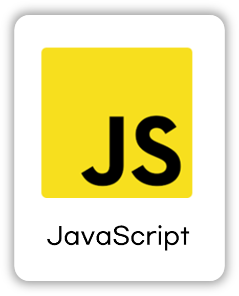

# OpenStore

## 배포 URL
https://nguswjd.github.io/OpenStore/

<hr>

## ⚙️ 기술 스택
### Front-end
<div>
  
  
</div>

### Tools
<div>
  
  
</div>

<hr>

## 📁 프로젝트 구조
```
📦OpenStore
 ┣ 📂assets                   <!-- icon 이미지 파일 -->
 ┃ ┗ 📜icons                         
 ┣ 📂components               <!-- header, main, footer, modal을 재사용을 하기 위한 폴더 -->
 ┃ ┣ 📜header.js
 ┃ ┣ 📜main.js                     
 ┃ ┣ 📜footer.js                   
 ┃ ┗ 📜modal.js                        
 ┣ 📂css                               
 ┃ ┣ 📜reset.css
 ┃ ┣ 📜style.js               <!-- 로그인 페이지, 회원가입 페이지, 제품 상세 페이지 제외 스타일 css -->
 ┃ ┣ 📜login-join.js          <!-- 로그인 페이지, 회원가입 페이지 스타일 css -->
 ┃ ┗ 📜product_details.js     <!-- 제품 상세 페이지 스타일 css -->
 ┣ 📂js
 ┃ ┣ 📜api.js                 <!-- api 모음 -->
 ┃ ┣ 📜DOM.js                 <!-- DOM 모음 -->
 ┃ ┣ 📜main.js
 ┃ ┣ 📜product_details.js
 ┃ ┣ 📜login.js
 ┃ ┗ 📜join.js
 ┣ 📜index.html
 ┣ 📜product_details.html
 ┣ 📜login.html
 ┣ 📜join.html
 ┗ 📜404.html
```

### 📂 js 파일
#### 📜main.js

#### 📜product_details.js

#### 📜login.js

#### 📜join.js


<hr>

## ⚒️ 추후에 구현할 부분
- SPA(Single Page Application) 방식 적용
- login.js > 94번 째 줄, 108번 쨰 줄 css 로 수정 필요

