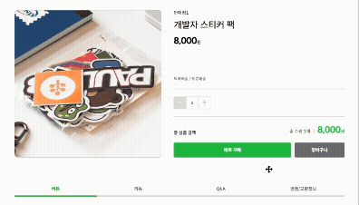
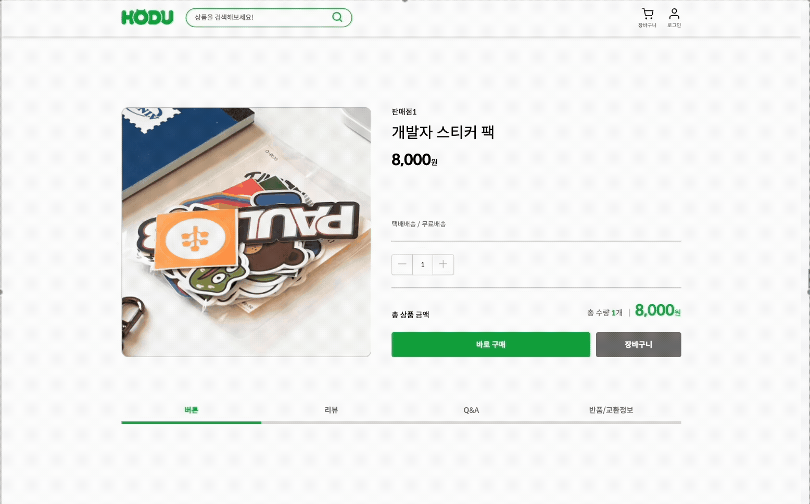

# OpenStore

## 배포 URL
https://nguswjd.github.io/OpenStore/

<hr>

## ⚙️ 기술 스택
### Front-end
<div>
  
  
</div>

### Tools
<div>
  
  
</div>

<hr>

## 📁 프로젝트 구조
```
📦OpenStore
 ┣ 📂assets                   <!-- icon 이미지 파일 -->
 ┃ ┗ 📜icons                         
 ┣ 📂components               <!-- header, main, footer, modal을 재사용을 하기 위한 폴더 -->
 ┃ ┣ 📜header.js
 ┃ ┣ 📜main.js                     
 ┃ ┣ 📜footer.js                   
 ┃ ┗ 📜modal.js                        
 ┣ 📂css                               
 ┃ ┣ 📜reset.css
 ┃ ┣ 📜style.js               <!-- 로그인 페이지, 회원가입 페이지, 제품 상세 페이지 제외 스타일 css -->
 ┃ ┣ 📜login-join.js          <!-- 로그인 페이지, 회원가입 페이지 스타일 css -->
 ┃ ┗ 📜product_details.js     <!-- 제품 상세 페이지 스타일 css -->
 ┣ 📂js
 ┃ ┣ 📜api.js                 <!-- api 모음 -->
 ┃ ┣ 📜DOM.js                 <!-- DOM 모음 -->
 ┃ ┣ 📜main.js
 ┃ ┣ 📜product_details.js
 ┃ ┣ 📜login.js
 ┃ ┗ 📜join.js
 ┣ 📜index.html
 ┣ 📜product_details.html
 ┣ 📜login.html
 ┣ 📜join.html
 ┗ 📜404.html
```

### 📂 js 파일
#### 📜main.js
<table style="width: 700px; margin: 0 auto;">
  <tr>
    <th style="text-align: center;">사용자 종류에 따른 Header 변경</th>
  </tr>
  <tr>
    <td style="text-align: center;">
      🧑‍💻 <strong>비사용자 (비로그인 상태)</strong><br><br>
      <br><br>
      📌 <code>localStorage</code>가 빈 상태일 때 장바구니/마이페이지가 비사용자 모드로 변경됩니다.
    </td>
  </tr>
  <tr>
    <td style="text-align: center;">
      🛍️ <strong>구매자 (BUYER)</strong><br><br>
      <br><br>
      📌 <code>localStorage.user_type</code>이 <code>BUYER</code>일 경우,<br>
      장바구니/마이페이지가 구매자용으로 변경됩니다.
    </td>
  </tr>
  <tr>
    <td style="text-align: center;">
      🏪 <strong>판매자 (SELLER)</strong><br><br>
      <br><br>
      📌 <code>localStorage.user_type</code>이 <code>SELLER</code>일 경우,<br>
      장바구니/마이페이지가 판매자용으로 변경됩니다.
    </td>
  </tr>
</table>

<br>

<table style="width: 700px; margin: 0 auto;">
  <tr>
    <th style="text-align: center;">모달</th>
  </tr>
  <tr>
    <td style="text-align: center;">
      <br><br>
      📌 비사용자 모드인 상태에서 장바구니 클릭시 모달이 표시됩니다.
    </td>
  </tr>
</table>

<br>

<table style="width: 700px; margin: 0 auto;">
  <tr>
    <th style="text-align: center;">메인 페이지 제품 목록</th>
  </tr>
  <tr>
    <td style="text-align: center;">
      <br><br>
      📌 상품 API을 호출하여 초기 페이지 <code>&lt;main&gt;</code>안에 제품 리스트를 보여줍니다.<br>
      리스트의 있는 제품을 클릭시 <code>localStorage</code>로 클릭 된 제품의 정보를 저장합니다.
    </td>
  </tr>
</table>

<br>

<table style="width: 700px; margin: 0 auto;">
  <tr>
    <th style="text-align: center;">로그아웃</th>
  </tr>
  <tr>
    <td style="text-align: center;">
      <br><br>
      📌 로그아웃 버튼을 클릭하면 localStorage에 저장된 사용자 정보가 삭제되어 로그아웃이 완료됩니다.<br><br>
      ※ 첨부된 영상 및 콘솔창에 표시된 사용자 정보는 이해를 돕기 위한 예시일 뿐이며,<br>
      실제 배포된 URL에서는 콘솔창에 사용자 정보가 출력되지 않습니다.
    </td>
  </tr>
</table>

<br>

#### 📜product_details.js

<table style="width: 700px; margin: 0 auto;">
  <tr>
    <th style="text-align: center;">제품 상세 정보</th>
  </tr>
  <tr>
    <td style="text-align: center;">
      <br><br>
      📌 초기 페이지의 제품 리스트 중 제품을 클릭하면, <br> <code>&lt;localStorage&gt;</code>에서 클릭 한 제품의 상세 정보를 호출하여 제품 구매 페이지에서 해당 제품을 보여줍니다.
    </td>
  </tr>
</table>

<table style="width: 700px; margin: 0 auto;">
  <tr>
    <th style="text-align: center;">제품 구매 정보</th>
  </tr>
  <tr>
    <td style="text-align: center;">
      <br><br>
      📌 제품 구매 페이지에서 수량을 선택하면 `js/main.js`에서 얻어온 상세 정보 중 <br> `stock`의 갯수만큼 `plus` 버튼이 비활성화 됩니다. <br>
      또한 마이너스/플러스 버튼을 클릭할시 구매 수량을 선택할 수 있습니다. <br> 수량을 선택할 때마다 상품의 금액과 수량이 변경됩니다.
    </td>
  </tr>
</table>

<table style="width: 700px; margin: 0 auto;">
  <tr>
    <th style="text-align: center;">모달</th>
  </tr>
  <tr>
    <td style="text-align: center;">
      <br><br>
      📌 비사용자 모드인 상태에서 장바구니 및 바로구매 버튼을 클릭시 모달이 표시됩니다.
    </td>
  </tr>
</table>

<table style="width: 700px; margin: 0 auto;">
  <tr>
    <th style="text-align: center;">리뷰 / QnA / 반품 교환 정보</th>
  </tr>
  <tr>
    <td style="text-align: center;">
      <br><br>
      📌 리뷰/QnA/반품 교환 정보를 클릭시 포커스가 됩니다.
    </td>
  </tr>
</table>

<br>

#### 📜login.js
<table style="width: 700px; margin: 0 auto;">
  <tr>
    <th style="text-align: center;">로그인</th>
  </tr>
  <tr>
    <td style="text-align: center;">
      <br><br>
      📌 사용자 로그인 API를 호출하여 입력값과 로그인 API를 비교하여 로그인을 합니다. <br> 이때 다른 페이지에서 로그인 정보를 확인하기 위해<br> 로그인 된 정보중 토큰과 사용자 정보가 `localStorage`가 저장됩니다. <br> 로그인 성공시 로그인 전 페이지로 이동하게 됩니다.
    </td>
  </tr>
</table>


<br>

#### 📜join.js
<table style="width: 700px; margin: 0 auto;">
  <tr>
    <th style="text-align: center;">판매자/구매자 선택</th>
  </tr>
  <tr>
    <td style="text-align: center;">
      <br><br>
      📌 판매자/구매자 선택을 클릭할때마다 <br>`input`안에 있는 값이 다시 입력할 수있도록 지워지며 에러 메시지도 함께 지워집니다. <br> 또한 선택한 유형에 따라 `user_type`이 저장됩니다.
    </td>
  </tr>
</table>

<table style="width: 700px; margin: 0 auto;">
  <tr>
    <th style="text-align: center;">회원가입</th>
  </tr>
  <tr>
    <td style="text-align: center;">
      <br><br>
      📌 회원가입시 필수 입력란의 메시지가 출력됩니다. <br> 회원가입에 성공할 경우 바로 로그인 할 수 있도록 로그인창으로 이동하게 됩니다.
      <br> 또한 아이디, 사업자 번호가 중복일 경우에는 로그인에 실패하게 됩니다.
    </td>
  </tr>
</table>


<br>

<hr>

## ⚒️ 추후에 구현할 부분
- SPA(Single Page Application) 방식 적용
- login.js > 94번 째 줄, 108번 쨰 줄 css로 수정 필요
- 세부적인 css 검토 필요